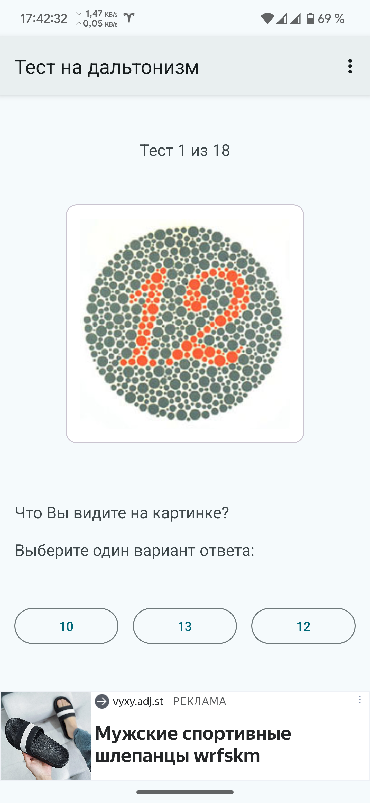
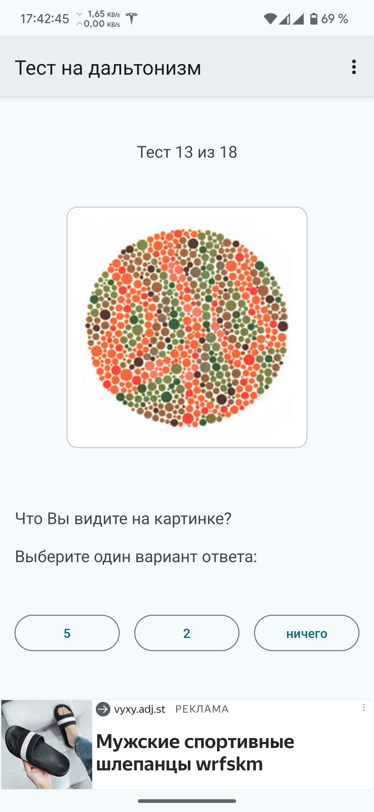
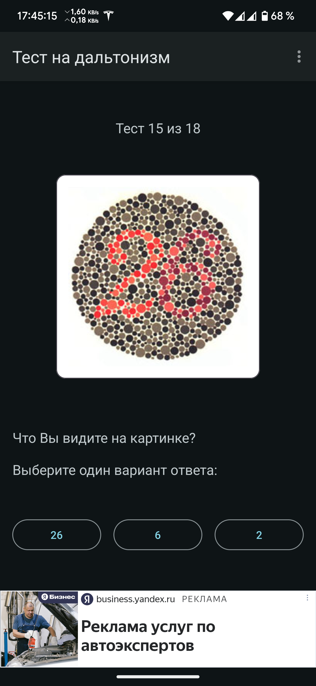
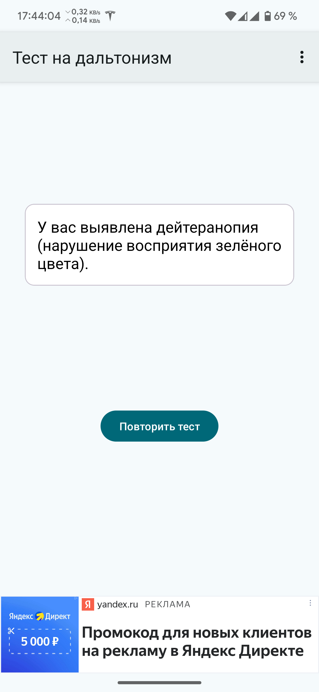
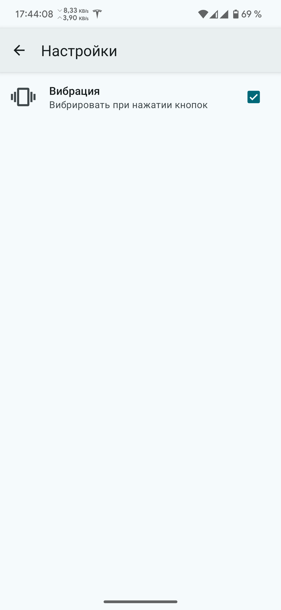
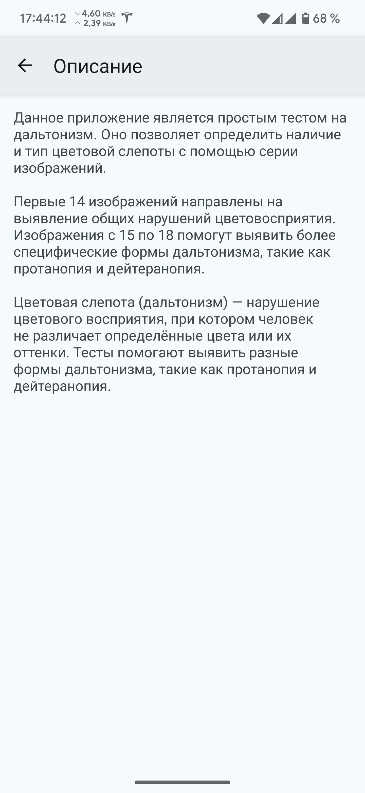

# Мобильное приложение "Тест на дальтонизм"

## Описание проекта

Данное приложение представляет собой **тест на дальтонизм**. Оно позволяет пользователю проверить свои способности различать цвета с помощью различных тестов. Приложение включает в себя визуальные тесты на основе изображений и предложений, которые пользователь должен интерпретировать и выбрать правильный ответ.

## Инструкция

**Для прохождения теста выполните следующие шаги:**

1. Внимательно изучите изображение, отображаемое на экране.
2. Выберите правильный ответ из предложенных вариантов.
3. По завершении всех тестов, приложение предоставит результаты и рекомендации.

## Технологии

- **Язык программирования:** Kotlin
- **Рекламные технологии:** Yandex Mobile Ads SDK
- **Дизайн:** Material You
- **Динамический цвет:** Поддержка динамического изменения цветовой схемы в зависимости от обоев и темы устройства
- **Система навигации:** Predictive Back Gesture — поддержка жестов для предсказуемой навигации назад
- **Настройки:** Реализованы через файл PreferenceScreen, включающий кастомные элементы и опции
- **Вибрация:** Использование вибрации для обратной связи при взаимодействии с элементами интерфейса. Поддержка различных версий Android и настроек вибрации.


## Ссылки на Google Play и RuStore

Вы можете скачать и установить приложение "Тест на дальтонизм" через **Google Play** или **RuStore** по ссылкам ниже:

<table>
  <tr>
    <td><a href="https://play.google.com/store/apps/details?hl=ru&gl=ru&id=com.den.shak.colorblindtest">
      
    </a></td>
    <td><a href="https://www.rustore.ru/catalog/app/com.den.shak.colorblindtest">
      
    </a></td>
  </tr>
</table>

## Скриншоты

Ниже представлены скриншоты приложения "Тест на дальтонизм":

<table>
  <tr>
    <td></td>
    <td></td>
    <td></td>
  </tr>
  <tr>
    <td></td>
    <td></td>
    <td></td>
  </tr>
</table>

## Инструкция по сборке проекта

1. **Клонируйте репозиторий:**
   ```
   git clone https://github.com/Den-88/colorblind_test
   ```
2. **Откройте проект в Android Studio:**
   - В главном меню выберите **"Open an existing project"** и укажите путь к проекту.

3. **Синхронизируйте Gradle:**
   - Когда появится уведомление, нажмите **"Sync Now"** для загрузки всех зависимостей.

4. **Соберите и запустите проект:**
   - Выберите режим сборки (`Debug` или `Release`).
   - Нажмите **"Run"**, чтобы начать выполнение на устройстве или эмуляторе.

## Разработчик
- **Шакуров Денис Дамирович**

---

Если есть какие-то дополнительные детали или изменения, дайте знать!